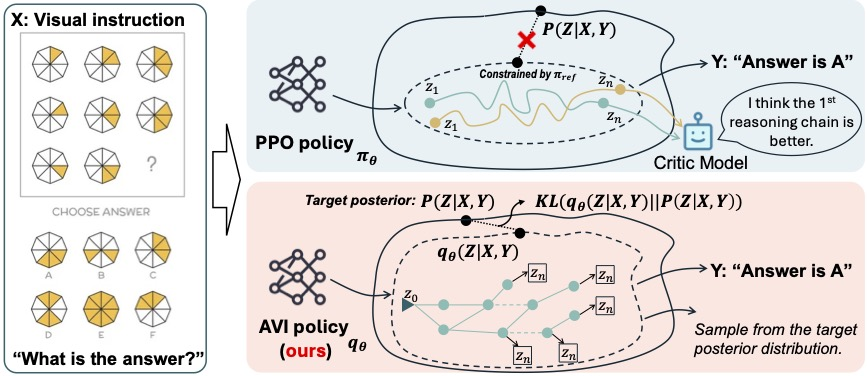

<p  align="center"  width="100%">

</p>

  

# LaCoT: Latent Chain-of-Thought for Visual Reasoning

[]()	[]()

[](https://huggingface.co/ZachSun/Qwen2.5VL-GFN-7B-1024) [](https://huggingface.co/ZachSun/Qwen2.5-gfn-3B)

  [](https://huggingface.co/ZachSun/Qwen2.5-gfn-sft-7b-250k) [](https://huggingface.co/ZachSun/Qwen2.5-gfn-sft-3b-250k)

## Release Notes

  

-  **[2025/08/134] 🔥 LaCoT-Qwen2.5VL** 

## Data Preparation
- [Stage-1 SFT Dataset](https://huggingface.co/datasets/ZachSun/visual-cot/blob/main/llava-cot%2Br1ov-250k.json): Download the dataset.
- [Stage-2 RL Dataset](https://huggingface.co/datasets/ZachSun/visual-cot/blob/main/gfn-3k.json): Download the dataset.
- Images from: [LLaVA-CoT](https://github.com/PKU-YuanGroup/LLaVA-CoT) and [R1-Onevision](https://github.com/Fancy-MLLM/R1-Onevision) (you may follow our [script](https://github.com/heliossun/qwen2.5-laCoT/blob/main/get_r1_ov_data.py) to prepare the data). 

Note: 
1. Download **LLaVA-CoT** in folder **cot**.
2. Download **R1-Onevision** in folder **cot/r1ov-image**

The final data path should look like this:
``` bash
cot
├── ai2d
├── chartqa
├── CLEVR_v1.0
├── coco
├── docvqa
├── geoqa+
├── gqa
├── llava
├── ocr_vqa
├── pisc
├── r1ov-image
├── sam
├── share_textvqa
├── sqa
├── textvqa
├── vg
├── web-celebrity
├── web-landmark
└── wikiart

```
  

## Models & Scripts

  

### Installation

  

#### 1. **Clone this repository and navigate to the LLaVA folder:**

```bash
git clone https://github.com/heliossun/LaCoT.git

cd  LaCoT
```

  

#### 2. **Install the inference package:**

```bash
conda  create  -n  qwen  python=3.10  -y
conda  activate  qwen

### if ImportError: /lib64/libc.so.6: version `GLIBC_2.32' not found
pip  install  torch==2.6.0  torchvision==0.21.0  torchaudio==2.6.0  --index-url  https://download.pytorch.org/whl/cu124
pip  install  flash-attn==2.7.4.post1  --no-build-isolation
pip  install  git+https://github.com/huggingface/transformers  accelerate
pip  install  qwen-vl-utils[decord]
## Install required packages
pip  install  deepspeed
pip  install  peft
pip  install  ujson
pip  install  liger_kernel
pip  install  dataset
pip  install  torchvision
pip  install  wandb
# use transformers==4.51.3 for training
```

  
### Training

### Evaluation

  
  
  

## Citation

  

If you find it useful for your research and applications, please cite related papers/blogs using this BibTeX:

```bibtex

```

  

## Acknowledgement


  

## Related Projects

